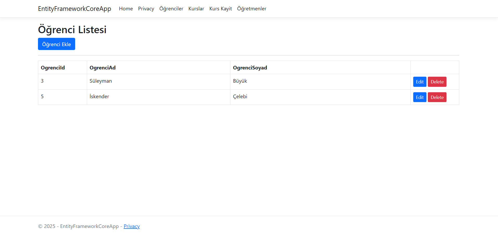
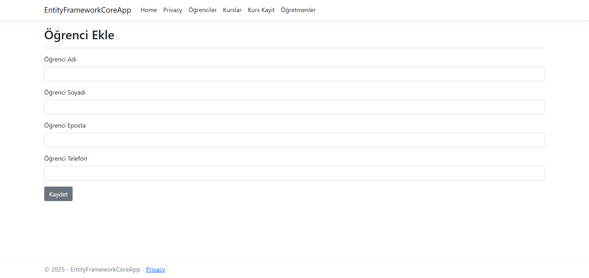
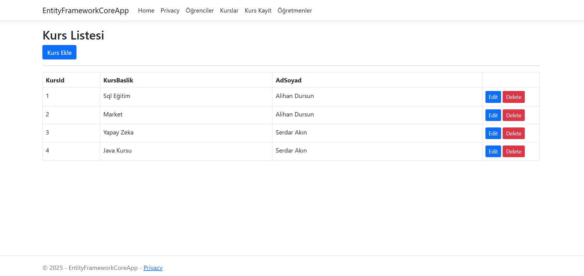
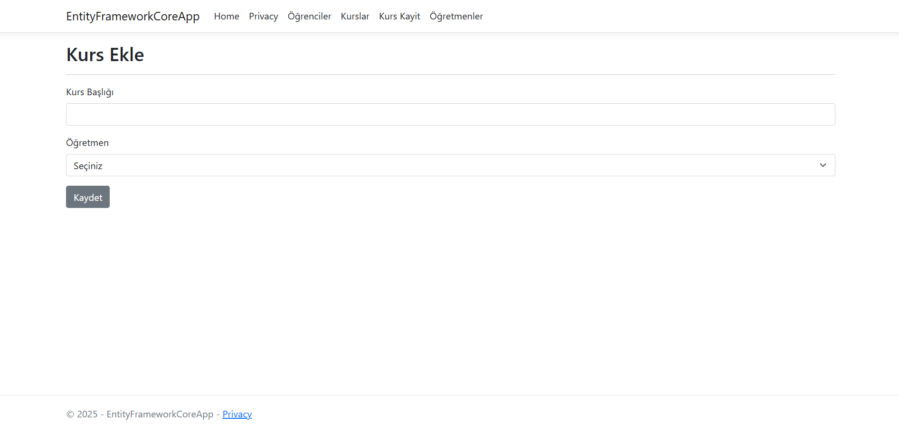
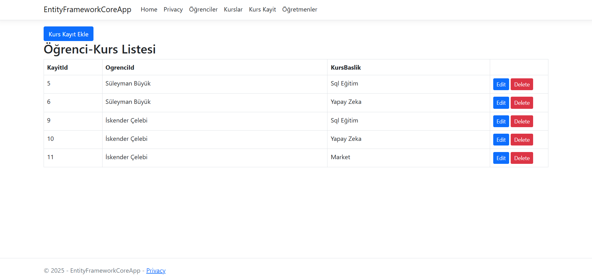
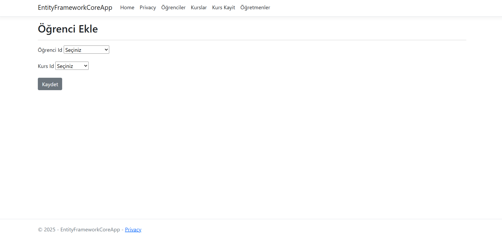
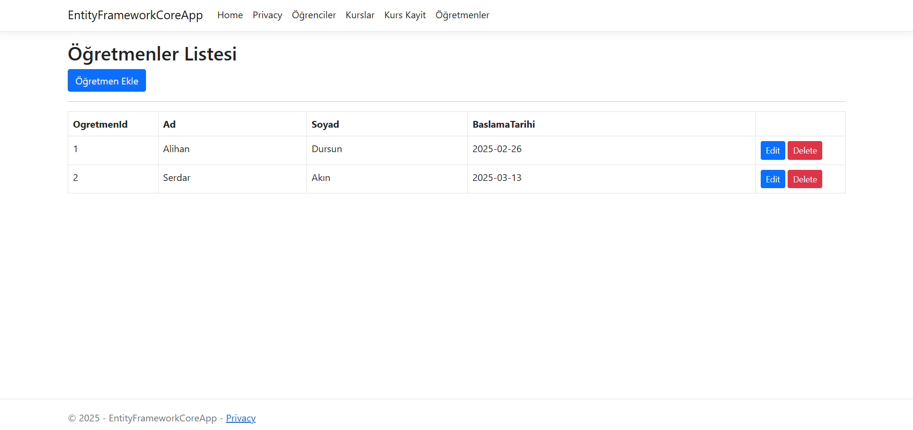
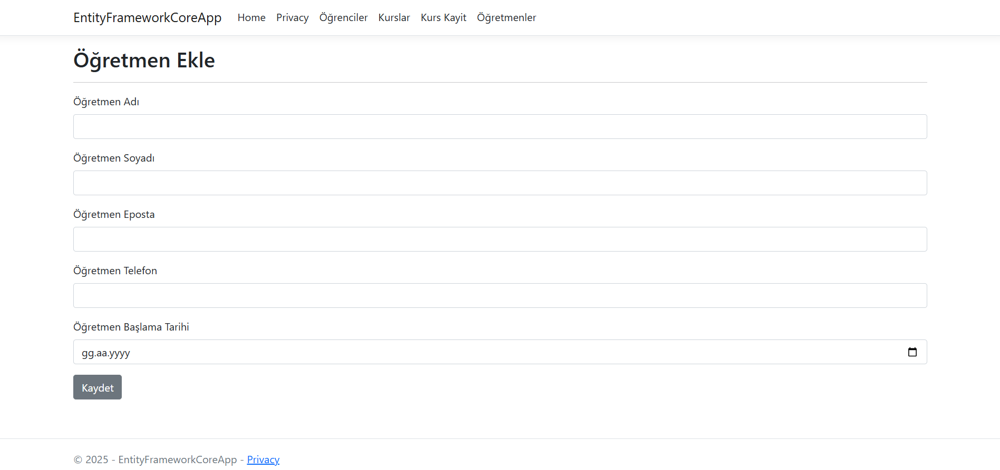

# 🎓 Online Eğitim Platformu (E-Learning System)

Bu proje, **ASP.NET Core MVC** mimarisi kullanılarak geliştirilmiş; öğrencilerin, eğitmenlerin ve kursların yönetildiği, dinamik bir eğitim yönetim sistemidir.

## 📋 Proje Hakkında

Proje, klasik bir CRUD uygulamasının ötesine geçerek, **İlişkisel Veri Modeli** üzerine kurulmuştur. Sistemde öğrenciler, öğretmenler ve kurslar ayrı varlıklar olarak yönetilirken, `Kurs Kayıt` modülü sayesinde öğrenciler diledikleri kurslara kayıt olabilirler. Bu yapı, gerçek dünyadaki bir kurs yönetim sisteminin temel backend mantığını simüle eder.

### 🚀 Temel Özellikler

Proje modüler bir yapıda (Controller bazlı) tasarlanmıştır:

* **📚 Kurs Yönetimi (`KursController`):**
    * Yeni kurs oluşturma, güncelleme ve silme.
    * Mevcut kursların kontenjan ve detay bilgilerinin listelenmesi.
* **👨‍🏫 Eğitmen Yönetimi (`OgretmenController`):**
    * Eğitmen profillerinin oluşturulması.
    * Hangi kursun hangi eğitmen tarafından verildiğinin takibi.
* **🎓 Öğrenci Yönetimi (`OgrenciController`):**
    * Öğrenci kaydı ve profillerin yönetimi.
* **📝 Kurs Kayıt İşlemleri (`KursKayitController`):**
    * **Kritik Özellik:** Bir öğrencinin bir kursa atanması işlemi.
    * İlişkisel veritabanı mantığıyla (Öğrenci <-> Kurs) kayıtların tutulması.

## 🛠️ Teknolojiler ve Mimari

* **Framework:** ASP.NET Core 5.0 / 6.0+ (MVC)
* **Dil:** C#
* **Veritabanı:** MySQL
* **ORM:** Entity Framework Core (Code First yaklaşımı)
* **Frontend:** Razor Views, HTML5, Bootstrap
* **Tasarım Deseni:** Model-View-Controller (MVC)

## 🏗️ Veritabanı İlişkileri

Proje arka planda şu ilişkisel yapıyı yönetir:
* **One-to-Many:** Bir Öğretmen -> Birden fazla Kurs verebilir.
* **Many-to-Many:** Bir Öğrenci -> Birden fazla Kursa kayıt olabilir; Bir Kursta -> Birden fazla öğrenci olabilir.

